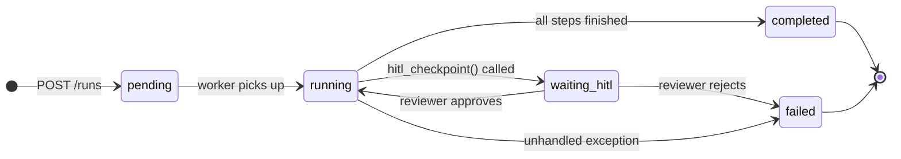
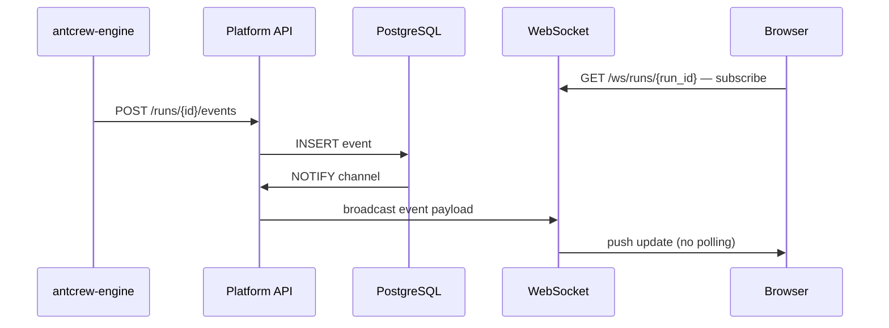

# Run lifecycle & events

## Run states

A run moves through a fixed set of states. The platform records every transition with a timestamp.



`waiting_hitl` is the only state where the run is intentionally paused. Everything else is either in-progress or terminal.

---

## TraceLog event types

The engine writes one event per significant action. All events are persisted in PostgreSQL and streamed over WebSocket to any connected dashboard.

| Event type | When it fires |
|---|---|
| `run_start` | `Agent.run()` is called |
| `llm_request` | A model call is sent — includes model, prompt, parameters |
| `llm_response` | The model responds — includes completion, token counts, latency |
| `tool_call` | The model invokes a tool or function |
| `tool_result` | The tool returns a result |
| `validation_error` | The output didn't match the contract schema — engine will retry |
| `hitl_requested` | `hitl_checkpoint()` was called — run is now `waiting_hitl` |
| `hitl_resolved` | A human approved or rejected — run resumes or fails |
| `run_complete` | All steps finished successfully |
| `run_error` | An unhandled exception ended the run |

---

## Ticket extraction

When a run completes, the platform scans its events for any structured output matching a ticket schema. Matching objects are upserted as tickets using a workspace-scoped atomic counter:

```sql
UPDATE workspace
SET ticket_counter = ticket_counter + 1
WHERE id = :workspace_id
RETURNING ticket_prefix, ticket_counter;
-- Returns: ("PROJ", 42) → ticket display ID = "PROJ-00042"
```

Upsert means re-running the same pipeline with the same external IDs won't create duplicate tickets.

---

## Real-time streaming

The platform uses PostgreSQL LISTEN/NOTIFY to broadcast events to all connected WebSocket clients. The sequence for a live dashboard view:



Latency from event write to browser update is typically under 100 ms.
