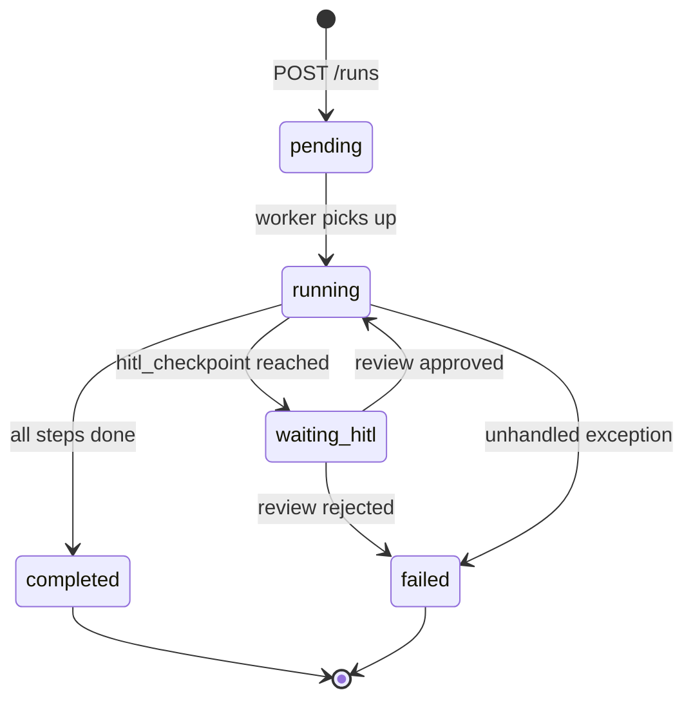

# Data flow

## Run lifecycle



## Event streaming

Events are written to PostgreSQL and broadcast to connected WebSocket clients in real time. The dashboard subscribes to `/ws/runs/{run_id}` to receive live updates without polling.

## Ticket creation

When a run completes, `upsert_tickets_from_run()` scans the run's events for any structured output that matches a ticket schema. Each ticket gets a workspace-scoped display ID (`PREFIX-NNNNN`) via an atomic counter:

```sql
UPDATE workspace
SET ticket_counter = ticket_counter + 1
WHERE id = :workspace_id
RETURNING ticket_prefix, ticket_counter;
```
