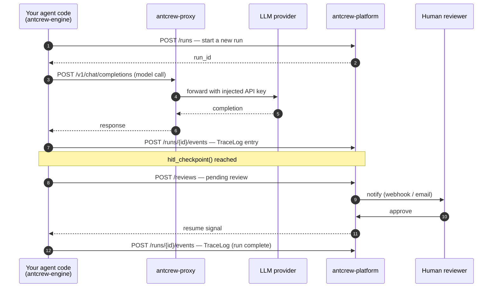

# Components & architecture

antcrew is made of three independent pieces. Each can run without the others, but together they give you end-to-end observability and control over your AI pipelines.

---

## antcrew-engine — the SDK

`antcrew-engine` is a Python library. It lives inside your agent code, not on a server.

**What it does:**

- Turns Python functions into LLM prompts via `@contract` — the docstring becomes the system prompt, the type annotations enforce the output schema
- Runs every LLM call through a configurable provider (`openai:gpt-4o`, `anthropic:claude-opus-5`, `simulated:echo` for tests…)
- Writes every token, tool call, and intermediate result to a **TraceLog** — a structured, append-only record of the full run
- Exposes `hitl_checkpoint()` — a blocking call that pauses agent execution and waits for a human to approve before continuing

**What it is not:** a server, a database, or a UI. It's a library.

```
pip install antcrew-engine
```

---

## antcrew-platform — the control plane

`antcrew-platform` is a FastAPI web application. It runs on a server (Fly.io, Docker, bare metal).

**What it does:**

- Receives runs from the engine via `POST /runs`
- Stores every event in PostgreSQL — status changes, TraceLog events, tickets created
- Serves a real-time dashboard over WebSocket so your team can watch runs live
- Manages HITL review queues — reviewers see pending approvals, can approve/reject/comment
- Extracts structured **tickets** from run output and gives them workspace-scoped display IDs (`PROJ-00001`)
- Sends outbound webhooks to your own systems when runs complete or reviews are needed

**What it is not:** it never executes your agent code. It is an observer and gating layer, not a worker.

---

## antcrew-proxy — the LLM gateway

`antcrew-proxy` is an OpenAI-compatible HTTP proxy.

**What it does:**

- Accepts model calls from the engine using the standard `POST /v1/chat/completions` interface
- Looks up the caller's workspace in the platform and injects the right provider API key (BYOK)
- Routes to the correct upstream provider based on the model prefix in the request
- Your application code never handles LLM credentials directly

**What it is not:** required. You can use the engine without the proxy by setting provider keys directly on the `Agent`. The proxy is valuable when you have multiple workspaces with different LLM budgets and key rotation requirements.

---

## How a run flows through the system



---

## Deploying the three components

| Component | Language | Recommended hosting |
|---|---|---|
| `antcrew-engine` | Python library | Ships with your agent code — no dedicated host |
| `antcrew-platform` | Python / FastAPI | Fly.io, Docker, any cloud VM |
| `antcrew-proxy` | Go | Fly.io, any cloud VM |

See [Self-hosting](../platform/deployment.md) for the full deployment guide.
