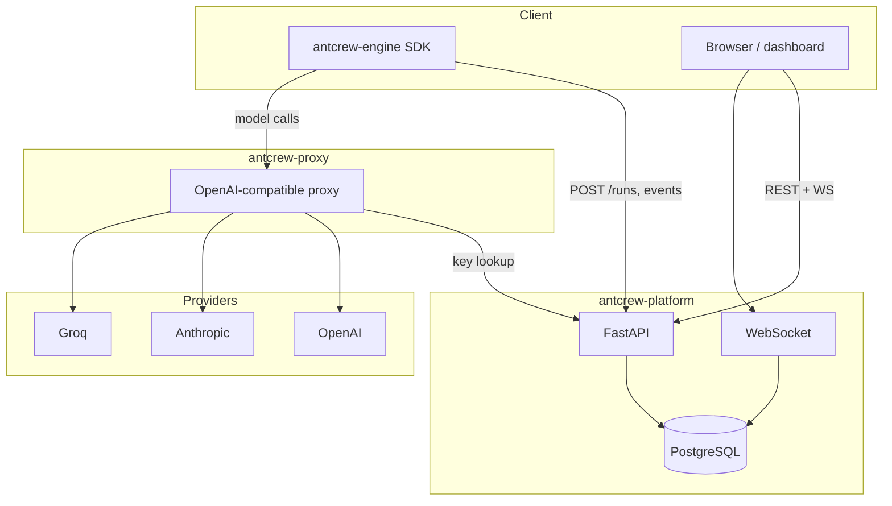

# System overview

## Components

## Environments

| Environment | URL | Infrastructure |
|---|---|---|
| INT | `platform-int.antcrew.org` | Fly.io, auto-deploy on push to main |
| UAT | `platform-uat.antcrew.org` | Hetzner CX22, on-demand, self-deletes |
| PROD | `antcrew.org` | Fly.io, requires UAT gate |
