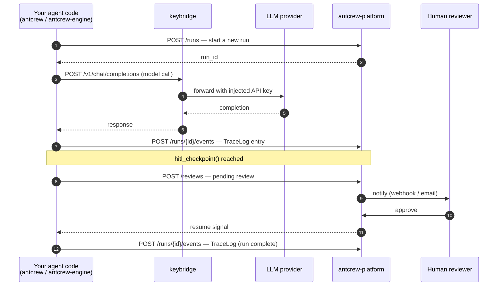

# Components & architecture

antcrew is made of three independent pieces. Each can run without the others, but together they give you end-to-end observability and control over your AI pipelines.

---

## antcrew — the agent framework + engine

`antcrew` is the Python package your team builds and ships agent logic with. Since v0.35.0, the `antcrew_engine` capability loop is **bundled inside** the antcrew wheel — one install gets everything.

**What it does:**

- Provides ready-made agent roles — PM, developer, reviewer, QA — built on LangGraph
- Runs capabilities (Architect, TaskPlanner, CodeGenerator, TestRunner…) through an `EngineLoop` that selects and dispatches work until the goal is satisfied
- Ships a CLI (`antcrew run …`) to execute pipelines locally or in CI
- Writes every token, capability result, and intermediate artifact to an **EventLog** and SQLite **TraceLog**
- Ships a `HitlReviewer` capability that pauses execution and waits for a human to approve before continuing
- Integrates with Slack, Telegram, and other notification channels

**What it is not:** a server or a UI. It's a library you install in your project.

```bash
pip install antcrew   # antcrew_engine bundled — no separate install needed
```

---

## antcrew-platform — the cloud control plane

`antcrew-platform` is the managed web application running at [antcrew.org](https://antcrew.org).

**What it does:**

- Receives runs from the engine via `POST /run/` and dispatches them to a background thread pool
- Stores every event — status changes, TraceLog events, tickets created — and serves them over a real-time WebSocket
- Serves the dashboard so your team can watch runs live, review HITL queues, and inspect tickets via the **Trace** tab
- Manages HITL review queues — reviewers see pending approvals and can approve, reject, or comment
- Extracts structured **tickets** from run output with workspace-scoped display IDs (`PROJ-00001`)
- Sends outbound webhooks to your own systems when runs complete or reviews are needed
- Configures **per-agent model overrides** at workspace level or per run — so different agents in the same pipeline can use different LLMs (see [Model configuration](../platform/model-config.md))
- Stores **run presets** — named `{team, model_overrides}` configurations reusable across runs

**What it is not:** it never executes your agent code. It is an observer and gating layer, not a worker.

---

## keybridge — the LLM gateway

`keybridge` is an OpenAI-compatible HTTP proxy.

**What it does:**

- Accepts model calls from the engine using the standard `POST /v1/chat/completions` interface
- Looks up the caller's workspace in the platform and injects the right provider API key (BYOK)
- Routes to the correct upstream provider based on the model prefix in the request (`openai:`, `anthropic:`, `groq:`, `gemini:`…)
- Your application code never handles LLM credentials directly

**What it is not:** required. You can use the engine without the proxy by setting provider keys directly on the `Agent`. The proxy is valuable when you have multiple workspaces with different LLM budgets or key rotation requirements.

---

## How a run flows through the system



---

## Component overview

| Component | Role | Where it runs |
|---|---|---|
| `antcrew` | Agent framework + EngineLoop + CLI (antcrew_engine bundled) | Your codebase |
| `antcrew-platform` | Dashboard, storage, HITL reviews | antcrew.org (managed cloud) |
| `keybridge` | LLM routing, BYOK key injection | antcrew.org or your own infra |

---

## State stores

Three distinct stores exist inside an AntCrew pipeline run. Understanding which one to use prevents subtle cross-run or cross-layer bugs:

| Store | Lifetime | Scope | Use for |
|---|---|---|---|
| **TeamState** (LangGraph) | One `team.run()` call | All agent nodes in the run | Typed artifact slots (PRD, tickets, code_artifacts…), LLM message history, metadata routing flags |
| **MemoryStore** (engine) | One `EngineLoop` instance | Layer-2 capability executors only | Accumulating code artifacts across loop iterations — never shared with Layer-1 teams |
| **KVMemory / RunMemory** (DB) | Cross-run, durable | One team in one workspace | Long-lived agent memory across separate runs (e.g. "decisions from the last sprint") |

Data flows one direction per call: `KVMemory → (loaded at run start) → TeamState → (saved at run end) → KVMemory`. The MemoryStore is internal to the EngineLoop and never crosses into TeamState.

---

## Artifact contracts

The `@agent_contract` decorator lets you declare build-time artifact contracts on agent classes. The Supervisor verifies them at `build()` time — before any LLM call — and raises `ContractViolationError` with a descriptive message if a consumed type has no producing predecessor in the flow.

```python
from antcrew.core.contracts import agent_contract
from antcrew.core.artifacts import PRD, CodeArtifact

@agent_contract(produces=PRD)
class BusinessAnalystAgent(BaseAgent): ...

@agent_contract(consumes=PRD, produces=CodeArtifact)
class BackendDevAgent(BaseAgent): ...
```

If `BackendDevAgent` is placed in the flow without a `BusinessAnalystAgent` predecessor, `build()` raises:

```
ContractViolationError: Artifact contract violation in agent 'backend_dev':
consumes PRD but no ancestor in the flow produces it.
Agents that produce PRD: (none — add @agent_contract(produces=...) to a predecessor).
```

Contract checking is transitive — it validates the full ancestor chain, not just direct predecessors.
