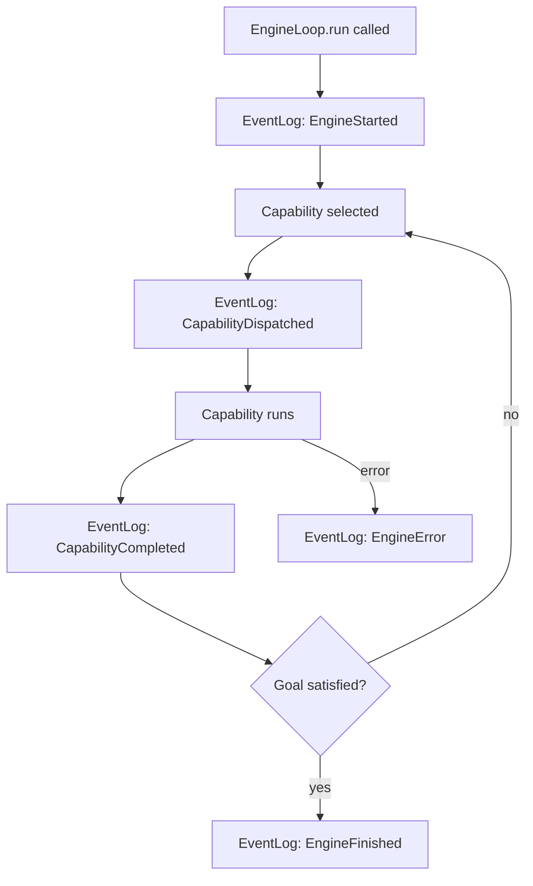

# EventLog & Replay

Every run executed by antcrew-engine produces a structured **EventLog** — an append-only record of every capability dispatch, result, HITL checkpoint, and error.

## What gets logged



## Event types

| Event class | When emitted |
|---|---|
| `EngineStarted` | Loop begins |
| `StateObserved` | After each validator pass |
| `EngineDecision` | Capability selected by the decision policy |
| `CapabilityDispatched` | Before capability.run() is called |
| `CapabilityCompleted` | After capability.run() succeeds |
| `ConditionSatisfied` | A goal condition transitions to satisfied |
| `CapabilityProgress` | Mid-run progress update (token stream, partial output) |
| `EngineFinished` | All conditions satisfied — loop exits normally |
| `EngineError` | Loop exits with STUCK / TIMEOUT / NO_PROGRESS / CANCELLED |

## Collecting events in memory

```python
from antcrew_engine.engine import EventLog

log = EventLog()
engine = EngineLoop(registry, validators, log)
engine.run(store, goal)

for event in log.events:
    print(event.kind, event.timestamp)
```

## Streaming events to the platform

`EventBusBridge` forwards each event to antcrew-platform in real time so runs appear live in the dashboard:

```python
from antcrew_engine.engine import EventBusBridge

bridge = EventBusBridge(
    platform_url="https://antcrew.org",
    api_key="acw_live_...",
    run_id="run_01HXYZ...",
)
engine = EngineLoop(registry, validators, bridge)
```

All events are visible in the run's **Trace** tab — one card per capability, with duration, cost, and produced artifact keys.

## Trace tab in the dashboard

When a run is started via `POST /engine/run`, the platform assigns a `run_id` and the engine streams events to it automatically. The run detail page exposes a **Trace** tab that renders the EventLog as a human-readable timeline:

- One card per capability, in execution order
- Status indicator (running / done) with duration and cost
- Produced artifact keys shown as chips
- Live token stream while the capability is still running

For programmatic access to the same data, use `GET /runs/{run_id}/events`.

!!! tip "Per-agent model config"
    The model shown in the Trace tab reflects the resolved model after applying `run.model_overrides` → `workspace.agent_models` → platform default. See [Model configuration](../platform/model-config.md) to configure which model each capability uses.
