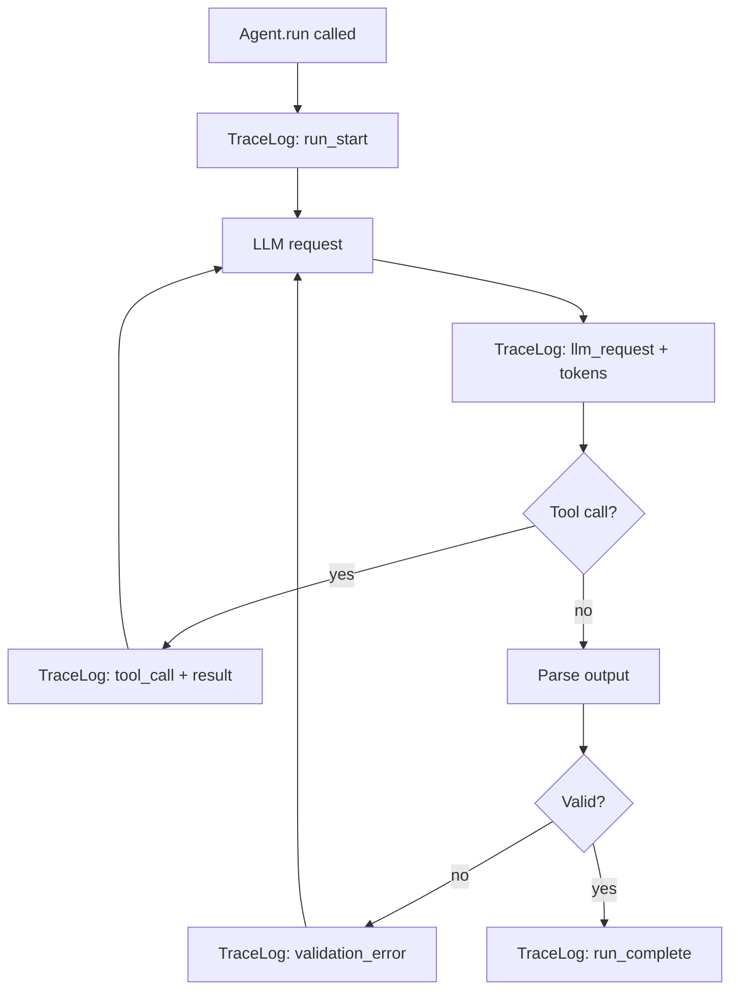

# TraceLog & Replay

Every run executed by antcrew-engine produces a **TraceLog** — a structured, append-only log of every LLM call, tool invocation, and intermediate result.

## What gets logged



## Replay

Any past run can be replayed exactly from its TraceLog without making new LLM calls:

```python
from antcrew import replay_run

# Replay a past run from its ID
result = replay_run("run_01HXYZ...")
```

Useful for:

- Debugging — step through exactly what the agent did
- Testing — assert on deterministic outputs without API costs
- Audit — demonstrate to stakeholders what the model decided and why

## Shipping logs to the Platform

```python
from antcrew import Agent
from antcrew.platform import PlatformSink

agent = Agent(
    model="openai:gpt-4o-mini",
    trace_sink=PlatformSink(
        base_url="https://platform-int.antcrew.org",
        api_key="your-key",
    ),
)
```

All events are streamed to the platform in real time and visible in the Runs dashboard.

## Trace tab in the dashboard

When a run executes through antcrew-platform (via `POST /run/`), the run detail page exposes a **Trace** tab that renders the TraceLog as a human-readable timeline:

- One card per agent, in execution order
- Status indicator (running / done) with duration
- Produced artifact keys shown as chips
- Live token stream while the agent is still running
- Model override label when the agent used a non-default model

The Trace tab is the primary surface for debugging agent behaviour without touching logs or raw JSON. For programmatic access to the same data, use `GET /runs/{run_id}/events`.

!!! tip "Per-agent model config"
    The model shown in the Trace tab reflects the resolved model after applying `run.model_overrides` → `workspace.agent_models` → platform default. See [Model configuration](../platform/model-config.md) to configure which model each agent uses.
