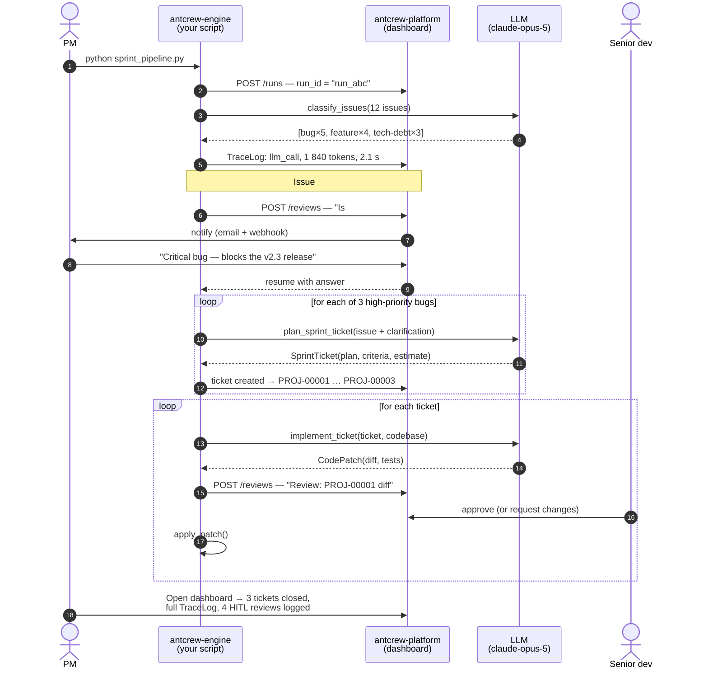

# A full team in action

This guide walks through a realistic scenario end-to-end: a five-person startup uses antcrew to automate their sprint planning and bug triage. You'll see how the engine, platform, and proxy interact, and what each one is responsible for.

---

## The scenario

The PM drops a message: *"We have 12 open GitHub issues. Find the three most critical bugs and ship fixes by Friday."*

In a traditional team this kicks off a half-day of triage meetings, tickets, handoffs, and status updates. With antcrew, a single Python script does it in minutes — with the team staying in the loop at the decisions that matter.

The pipeline has three stages:

1. **Analyst agent** — reads all 12 issues, classifies by severity
2. **PM agent** — creates sprint tickets for the top bugs, asks HITL when an issue is ambiguous
3. **Dev agent loop** — one agent per ticket: plans, implements, writes tests; pauses for code review before committing

---

## Step 1 — Define the contracts

Contracts are plain Python functions. The function signature is the schema; the docstring is the prompt.

```python
from antcrew import contract
from pydantic import BaseModel
from typing import Literal

class Issue(BaseModel):
    number: int
    title: str
    body: str

class ClassifiedIssue(BaseModel):
    number: int
    category: Literal["bug", "feature", "tech-debt", "docs"]
    severity: Literal["critical", "high", "medium", "low"]
    needs_clarification: bool
    clarification_question: str | None = None

@contract
def classify_issues(issues: list[Issue]) -> list[ClassifiedIssue]:
    """
    You are a senior engineer reviewing GitHub issues.
    Classify each issue by category and severity.
    If an issue is ambiguous — for example it could be a bug or a product
    decision — set needs_clarification=True and write a specific question
    for the PM to answer.
    """
    ...


class SprintTicket(BaseModel):
    issue_number: int
    title: str
    implementation_plan: str
    acceptance_criteria: list[str]
    estimated_hours: float

@contract
def plan_sprint_ticket(
    issue: ClassifiedIssue,
    clarification: str | None = None,
) -> SprintTicket:
    """
    Create a detailed implementation plan for this issue.
    If a clarification is provided, incorporate it into the plan.
    Write acceptance criteria as a checklist that a reviewer can verify.
    """
    ...


class CodePatch(BaseModel):
    files_changed: list[str]
    diff: str
    test_file: str
    test_description: str

@contract
def implement_ticket(ticket: SprintTicket, codebase_context: str) -> CodePatch:
    """
    Implement the ticket described in the plan.
    Write production-quality code and a corresponding test.
    The diff must apply cleanly to the codebase context provided.
    """
    ...
```

Notice: no model names, no prompt engineering, no JSON parsing. The engine handles all of that.

---

## Step 2 — Wire up the pipeline

```python
from antcrew import Agent
from antcrew.hitl import hitl_checkpoint
from antcrew.platform import PlatformSink

# All TraceLog events stream to the platform in real time
platform = PlatformSink(
    base_url="https://platform.yourcompany.com",
    api_key="acw_live_...",
    workspace="engineering",
)
agent = Agent(model="anthropic:claude-opus-5", trace_sink=platform)

# ── Stage 1: classify all issues ───────────────────────────────────────────
raw_issues = fetch_github_issues(repo="myorg/myapp", state="open")
classified: list[ClassifiedIssue] = agent.run(
    classify_issues, issues=raw_issues
)
# → antcrew-platform records this as a run with TraceLog entries for every
#   LLM call: prompt, completion, token count, latency.

# ── Stage 2: resolve ambiguities via HITL ──────────────────────────────────
for issue in classified:
    if issue.needs_clarification:
        # Execution pauses here. The platform shows a review card to the PM.
        # The PM types their answer. Execution resumes.
        answer = hitl_checkpoint(
            prompt=issue.clarification_question,
            context={"issue": issue.number, "title": issue.title},
        )
        issue.clarification_answer = answer

# ── Stage 3: PM agent creates tickets ──────────────────────────────────────
high_priority = [i for i in classified if i.severity in ("critical", "high")]
tickets: list[SprintTicket] = [
    agent.run(plan_sprint_ticket, issue=i, clarification=i.clarification_answer)
    for i in high_priority
]
# → Each ticket is persisted in the platform as PROJ-00001, PROJ-00002, …
#   visible in the Tickets view immediately.

# ── Stage 4: dev agents implement each ticket ───────────────────────────────
codebase_context = load_codebase_summary()

for ticket in tickets:
    patch: CodePatch = agent.run(
        implement_ticket, ticket=ticket, codebase_context=codebase_context
    )

    # Another HITL: a senior dev reviews the diff before it's committed.
    hitl_checkpoint(
        prompt=f"Review implementation of: {ticket.title}",
        context={
            "ticket": ticket.title,
            "files": patch.files_changed,
            "diff": patch.diff,
            "tests": patch.test_description,
        },
    )
    apply_patch(patch)
```

---

## What happens in each system



---

## What you see in the platform

After the pipeline runs, the platform dashboard shows the complete picture:

**Runs view** — one run entry for the entire pipeline, with status, duration, total token usage, and a list of every TraceLog event. Click any event to see the exact prompt and completion.

**Tickets view** — `PROJ-00001`, `PROJ-00002`, `PROJ-00003` appear with their implementation plans and acceptance criteria. Each ticket links back to the run that created it.

**HITL Reviews** — four review cards in the audit log: one for the ambiguous issue, three for the code patches. Each shows who approved, when, and what they said.

**TraceLog replay** — any individual LLM call can be replayed offline to debug or verify outputs without spending API credits.

---

## Key takeaways

| What you write | What antcrew handles |
|---|---|
| `@contract` functions with typed signatures | Prompt construction, JSON parsing, retry on invalid output |
| `hitl_checkpoint()` calls | Review queue, notifications, blocking/resuming execution |
| `Agent(model=..., trace_sink=...)` | Token logging, TraceLog persistence, provider routing |
| Business logic between agents | Nothing — your orchestration, your control flow |

The team sees everything. The agents do the repetitive work. The humans make the calls that matter.
