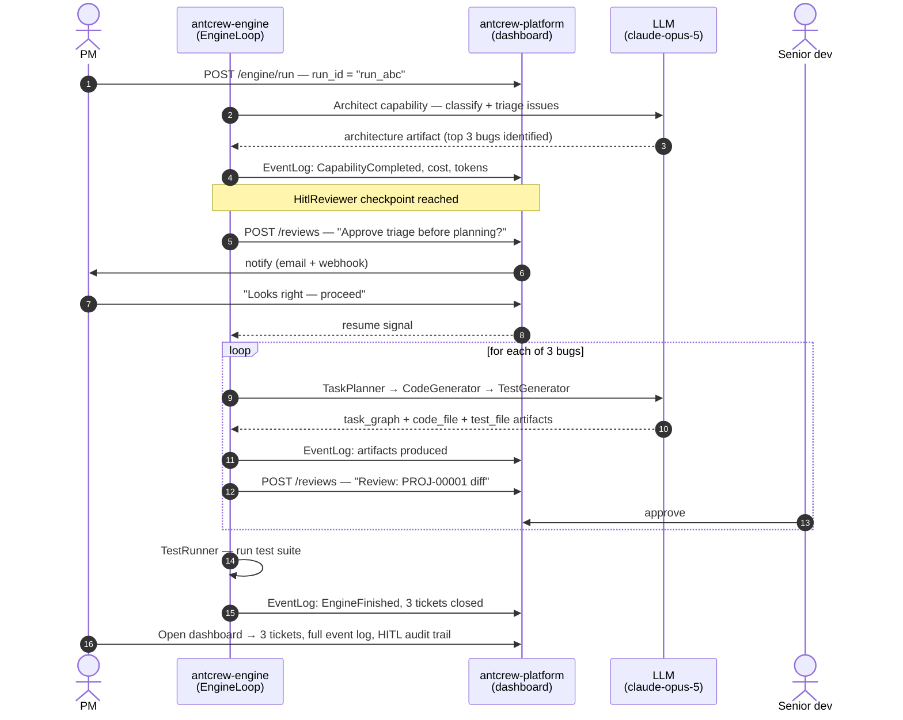

# A full team in action

This guide walks through a realistic scenario end-to-end: a five-person startup uses antcrew to automate their sprint planning and bug triage. You'll see how the engine, platform, and proxy interact, and what each one is responsible for.

---

## The scenario

The PM drops a message: *"We have 12 open GitHub issues. Find the three most critical bugs and ship fixes by Friday."*

In a traditional team this kicks off a half-day of triage meetings, tickets, handoffs, and status updates. With antcrew, a single engine run does it in minutes — with the team staying in the loop at the decisions that matter.

The pipeline has three stages:

1. **Triage** — reads all 12 issues, classifies by severity, flags ambiguous ones for HITL
2. **Planning** — creates sprint tickets for the top bugs
3. **Implementation** — one capability per ticket: plans, implements, writes tests; pauses for code review before committing

---

## Step 1 — Start an engine run via the platform

The quickest way to kick off the pipeline is through the platform API:

```bash
curl -X POST https://antcrew.org/engine/run \
  -H "X-Api-Key: acw_live_..." \
  -H "Content-Type: application/json" \
  -d '{
    "goal": "Triage the 12 open GitHub issues in myorg/myapp, create sprint tickets for the top 3 critical bugs, and produce implementation patches with tests for each one.",
    "context": {
      "repo": "myorg/myapp",
      "target_count": 3,
      "severity_threshold": "high"
    },
    "hitl_after": ["Architect", "CodeReviewer"],
    "model": "anthropic:claude-opus-5"
  }'

# → {"run_id": "run_abc123", "status": "running"}
```

`hitl_after` tells the engine to pause after the listed capabilities and wait for a human to approve before continuing.

---

## Step 2 — Wire up a custom pipeline in Python

For tighter control — custom tools, conditional branching, domain-specific capabilities — use `EngineLoop` directly:

```python
from antcrew_engine import (
    EngineLoop, MemoryStore, Goal, DesiredProjectState,
    Constraints, Condition, ConditionId,
    Architect, TaskPlanner, CodeGenerator, TestGenerator, TestRunner,
    HitlReviewer, artifact_validators, CapabilityRegistry,
)
from antcrew_engine.config import build_llm
from antcrew_engine.engine import EventBusBridge

llm = build_llm("anthropic:claude-opus-5")

registry = CapabilityRegistry()
registry.register(Architect(llm))
registry.register(TaskPlanner(llm))
registry.register(CodeGenerator(llm))
registry.register(TestGenerator(llm))
registry.register(TestRunner())
# Pause after CodeGenerator and wait for a human to approve the diff
registry.register(HitlReviewer(
    platform_url="https://antcrew.org",
    api_key="acw_live_...",
    after_capability="CodeGenerator",
    prompt="Review the implementation diff before tests run.",
))

goal = Goal(
    description="Fix the top 3 critical bugs from the GitHub issue backlog",
    desired_state=DesiredProjectState(conditions=[
        Condition(ConditionId("architecture_exists"), "Triage complete, top issues identified"),
        Condition(ConditionId("implementation_exists"), "All tasks have code files"),
        Condition(ConditionId("tests_pass"), "Test suite passes"),
    ]),
    constraints=Constraints(max_iterations=30),
)

store = MemoryStore()
bridge = EventBusBridge(
    platform_url="https://antcrew.org",
    api_key="acw_live_...",
    run_id="run_abc123",
)
engine = EngineLoop(registry, artifact_validators, bridge)
final_state = engine.run(store, goal)

# Retrieve artifacts
code_files = store.get_all("code_file")
test_files = store.get_all("test_file")
```

---

## What happens in each system



---

## What you see in the platform

After the pipeline runs, the platform dashboard shows the complete picture:

**Runs view** — one run entry for the entire pipeline, with status, duration, total token usage, and every EventLog entry. Click any event to see the capability name, input, and output.

**Tickets view** — `PROJ-00001`, `PROJ-00002`, `PROJ-00003` appear with implementation plans and acceptance criteria. Each ticket links back to the run that created it.

**HITL Reviews** — review cards in the audit log: one for the triage approval, three for the code patches. Each shows who approved, when, and what they said.

---

## Key takeaways

| What you configure | What antcrew handles |
|---|---|
| `Goal` with `Condition` objects | Which capabilities to run and in what order |
| `HitlReviewer` in the registry | Review queue, notifications, blocking/resuming execution |
| `build_llm(model)` | Token logging, provider routing, retry on failure |
| `EventBusBridge` | Real-time event streaming to the platform dashboard |
| Business logic between capabilities | Nothing — the `EngineLoop` decides; you observe via the platform |

The team sees everything. The engine does the repetitive work. The humans make the calls that matter.
