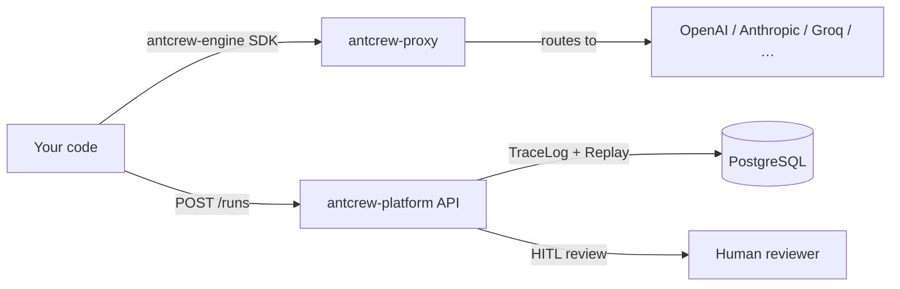

# antcrew

**antcrew** is an AI agent orchestration platform built for teams that need reliable, auditable, human-in-the-loop AI workflows.

## Products

- **Platform** — web UI and API for managing workspaces, runs, tickets, and reviews
- **Engine** — typed Python SDK for defining and executing agent contracts
- **Proxy** — OpenAI-compatible proxy with provider routing and BYOK support

## Architecture at a glance

## Quick links

- [Getting started with Platform](platform/getting-started.md)
- [Typed contracts with Engine](engine/contracts.md)
- [TraceLog & Replay](engine/tracelog.md)
- [Proxy routing](proxy/routing.md)
