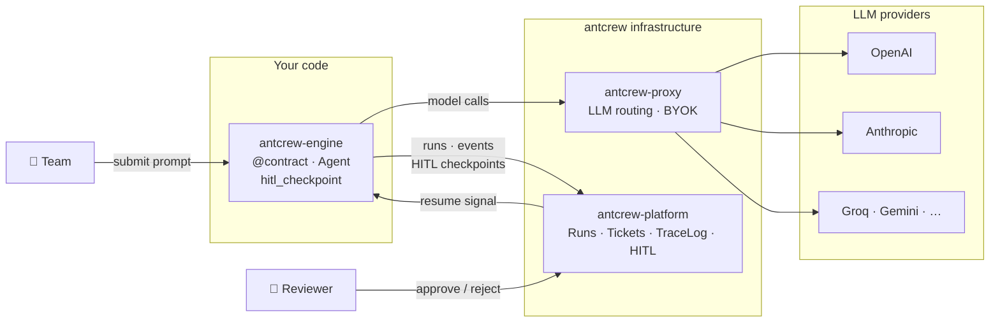

# antcrew

**antcrew** gives teams a shared control plane for AI agent workflows — with typed contracts that guarantee structured output, a full replay log of every decision, and human-in-the-loop gates that stop the automation before it does something it shouldn't.

---

## Three components, one system

<div class="grid cards" markdown>

-   **antcrew-engine** · SDK

    ---

    The Python library your agents import. Defines typed contracts, runs LLM calls, logs every token to a TraceLog, and pauses for human review when you ask it to.

    ```bash
    pip install antcrew-engine
    ```

    [:octicons-arrow-right-24: Engine SDK](engine/index.md)

-   **antcrew-platform** · Web app + API

    ---

    The server that receives runs, stores the TraceLog, shows the dashboard, and surfaces HITL review queues to your team. You can self-host it or use the managed cloud.

    [:octicons-arrow-right-24: Platform](platform/index.md)

-   **antcrew-proxy** · LLM gateway

    ---

    An OpenAI-compatible proxy that routes model calls to any provider — OpenAI, Anthropic, Groq, Gemini — with BYOK key management and per-workspace routing rules.

    [:octicons-arrow-right-24: Proxy](proxy/index.md)

</div>

---

## How they connect



The engine lives **in your code**. The platform and proxy are **shared infrastructure** — hosted by you or by antcrew. The only coupling is a REST API and a model endpoint URL.

---

## Start here

- **New to antcrew?** Read [A full team in action](guides/fullstack-team.md) — a complete walkthrough from prompt to shipped code.
- **Ready to build?** Follow the [Quick start](platform/getting-started.md) to run your first agent pipeline in under five minutes.
- **Just the SDK?** Jump to [Typed contracts](engine/contracts.md) if you already have a platform running.
