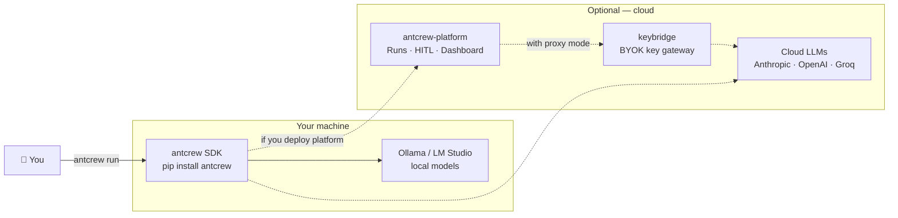

# antcrew

**Multi-agent framework for Python. Typed outputs. Full trace. Works offline.**

One command to your first agent team — no cloud account, no API key required:

```bash
pip install antcrew
antcrew run "Build a FastAPI auth service" --model ollama:llama3
```

Or three lines of Python:

```python
from antcrew import QuickStart

result = QuickStart.dev().run("Build a FastAPI auth service")
print(result.state["prd"].title)       # typed PRD artifact
print(result.state["code_artifacts"])  # typed code files
```

---

## What antcrew gives you

| Capability | Detail |
|---|---|
| **Typed output contracts** | Every agent produces a Pydantic artifact — `PRD`, `CodeArtifact`, `SecurityReport` — not a raw dict. Downstream agents receive typed inputs; mismatches fail at definition time, not at runtime. |
| **Trace & replay** | Every run writes a local `TraceLog` (SQLite). Replay any past run step-by-step, diff two runs, or re-run from a checkpoint. |
| **Works 100% offline** | Ollama is a first-class provider. `--model ollama:llama3` routes all LLM calls to your local instance — no network, no API key, no cost. |
| **3 lines to first agent team** | `QuickStart.dev().run("Build a FastAPI auth service")` is the entire program. |
| **Governance hash per agent** | Each agent turn is SHA-256 hashed (model config + inputs + outputs). The hash is stored in the TraceLog and exposed via `antcrew inspect`. |
| **29 CLI commands** | `antcrew run`, `antcrew inspect`, `antcrew trace replay`, `antcrew test`, and 25 more — all local, no platform account needed. |

---

## How the pieces fit together



`antcrew` runs entirely on your machine. The platform is an optional cloud layer — your pipelines work without it.

---

## Start here

=== "Local — no API key"

    ```bash
    pip install antcrew

    # Simulated LLM — zero cost, deterministic, runs anywhere
    antcrew run --model simulated "Build a user auth module"

    # Fully local with Ollama (ollama pull llama3 first)
    antcrew run --model ollama:llama3 "Build a user auth module"
    ```

    → [5-minute quick start](guides/quickstart.md)

=== "Cloud model"

    ```bash
    pip install antcrew
    export ANTHROPIC_API_KEY=sk-ant-...
    antcrew run --model claude "Build a user auth module"
    ```

    → [LLM providers](engine/providers.md)

=== "Team (Python)"

    ```python
    from antcrew import DevTeam
    from antcrew.models import OllamaModel

    team = DevTeam(model=OllamaModel("llama3"))
    result = team.run("Build a user auth module")
    print(result.state["prd"].title)
    print(result.cost_usd)   # 0.0 with Ollama
    ```

    → [A full team in action](guides/fullstack-team.md)

---

## Components

**antcrew** (this package) is what almost everyone needs:

```bash
pip install antcrew
```

It ships with `antcrew_engine` built in — the autonomous `EngineLoop` that powers named-role teams. You don't need to install anything extra.

**antcrew-platform** is an optional cloud backend for teams that need multi-workspace runs, remote HITL, and a shared dashboard. [→ Platform docs](platform/index.md)

**keybridge** is a companion to antcrew-platform for teams that want their LLM API keys to stay on their own infrastructure. [→ Proxy docs](proxy/index.md)
