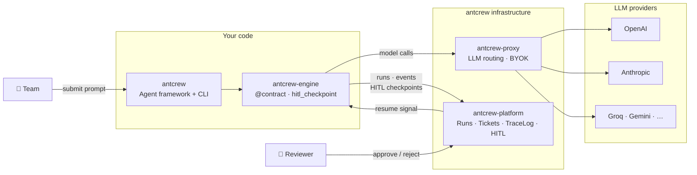

# antcrew

**antcrew** gives teams a shared control plane for AI agent workflows — with typed contracts that guarantee structured output, a full replay log of every decision, and human-in-the-loop gates that stop the automation before it does something it shouldn't.

---

## Four components, one system

<div class="grid cards" markdown>

-   **antcrew** · Agent framework

    ---

    The Python package your team ships agent logic with. Built on LangGraph, it provides ready-made agent roles (PM, developer, reviewer…), a CLI to run pipelines locally, and integrations for Slack, Telegram, and more.

    ```bash
    pip install antcrew
    ```

    [:octicons-arrow-right-24: Engine SDK](engine/index.md)

-   **antcrew-engine** · Core SDK

    ---

    The low-level library powering the framework. Defines `@contract` for typed LLM calls, writes every token to a TraceLog, and exposes `hitl_checkpoint()` to pause execution for human review.

    ```bash
    pip install antcrew-engine
    ```

    [:octicons-arrow-right-24: Typed contracts](engine/contracts.md)

-   **antcrew-platform** · Cloud control plane

    ---

    The managed web application at [antcrew.org](https://antcrew.org). Receives runs from the engine, stores the full TraceLog, shows the live dashboard, and surfaces HITL review queues to your team.

    [:octicons-arrow-right-24: Platform](platform/index.md)

-   **antcrew-proxy** · LLM gateway

    ---

    An OpenAI-compatible proxy that routes model calls to any provider — OpenAI, Anthropic, Groq, Gemini — with BYOK key management and per-workspace routing rules.

    [:octicons-arrow-right-24: Proxy](proxy/index.md)

</div>

---

## How they connect



`antcrew` and `antcrew-engine` live **in your code**. The platform is **managed cloud** — hosted at antcrew.org. The proxy can run anywhere: antcrew-managed or your own infra. The only coupling between them is a REST API and a model endpoint URL.

---

## Start here

- **New to antcrew?** Read [A full team in action](guides/fullstack-team.md) — a complete walkthrough from prompt to shipped code.
- **Ready to build?** Follow the [Quick start](platform/getting-started.md) to connect your first agent pipeline in minutes.
- **Just the SDK?** Jump to [Typed contracts](engine/contracts.md) if you already have a platform account.
