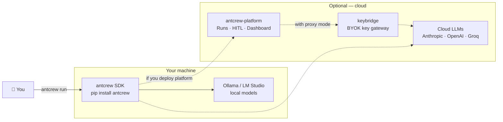

# antcrew

**Multi-agent framework for Python. Typed outputs. Full trace. Works offline.**

One command to your first agent team — no cloud account, no API key required:

```bash
pip install antcrew
antcrew run "Build a FastAPI auth service" --model ollama:llama3
```

Or three lines of Python:

```python
from antcrew import QuickStart

result = QuickStart.dev().run("Build a FastAPI auth service")
print(result.state["prd"].title)       # typed PRD artifact
print(result.state["code_artifacts"])  # typed code files
```

---

## What makes antcrew different

Every output is a **typed artifact** (Pydantic class, not a dict) and every decision is written to a **local TraceLog** you can replay. Both work offline, for free.

| | antcrew | CrewAI | MetaGPT |
|---|---|---|---|
| Typed output contracts | ✓ Pydantic artifacts | ✗ dict | partial |
| Trace & replay any run | ✓ SQLite TraceLog | ✗ | ✓ |
| Works 100% offline | ✓ Ollama natively | partial | partial |
| Lines to first agent | **3** | ~15 | ~20 |
| Governance hash per agent | ✓ SHA-256 | ✗ | ✗ |
| CLI (commands) | ✓ 29 commands | limited | basic |

---

## How the pieces fit together



`antcrew` runs entirely on your machine. The platform is an optional cloud layer — your pipelines work without it.

---

## Start here

=== "Local — no API key"

    ```bash
    pip install antcrew

    # Simulated LLM — zero cost, deterministic, runs anywhere
    antcrew run --model simulated "Build a user auth module"

    # Fully local with Ollama (ollama pull llama3 first)
    antcrew run --model ollama:llama3 "Build a user auth module"
    ```

    → [5-minute quick start](guides/quickstart.md)

=== "Cloud model"

    ```bash
    pip install antcrew
    export ANTHROPIC_API_KEY=sk-ant-...
    antcrew run --model claude "Build a user auth module"
    ```

    → [LLM providers](engine/providers.md)

=== "Team (Python)"

    ```python
    from antcrew import DevTeam
    from antcrew.models import OllamaModel

    team = DevTeam(model=OllamaModel("llama3"))
    result = team.run("Build a user auth module")
    print(result.state["prd"].title)
    print(result.cost_usd)   # 0.0 with Ollama
    ```

    → [A full team in action](guides/fullstack-team.md)

---

## Components

**antcrew** (this package) is what almost everyone needs:

```bash
pip install antcrew
```

It ships with [antcrew-engine](https://github.com/iagop03/antcrew-engine) built in — the autonomous `EngineLoop` that powers named-role teams. You don't need to install or import `antcrew-engine` directly.

**antcrew-platform** is an optional cloud backend for teams that need multi-workspace runs, remote HITL, and a shared dashboard. [→ Platform docs](platform/index.md)

**keybridge** is a companion to antcrew-platform for teams that want their LLM API keys to stay on their own infrastructure. [→ Proxy docs](proxy/index.md)
