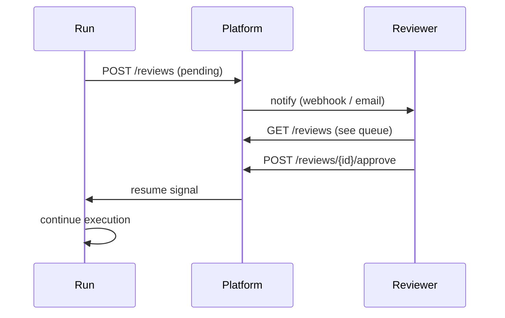

# HITL Reviews

**Human-in-the-loop (HITL)** reviews let a human approve, reject, or modify AI output before it has downstream effects.

## Creating a review

Reviews are created automatically when the engine reaches a HITL checkpoint (via the `HitlReviewer` capability), or manually from the dashboard.

## Review workflow



## Assignees

Reviews can be assigned to specific workspace members. Unassigned reviews are visible to all members with the `reviewer` role.

## Channel routing

By default every HITL review arrives in the platform dashboard (`hitl_channel: "default"`). Agents can declare a preferred channel:

```python
class MyAgent(BaseAgent):
    hitl_channel = "slack"          # routing hint stored on each HitlReview row
```

The `hitl_channel` value is stored in the `HitlReview.hitl_channel` column and included in the `hitl.review_required` event payload so external integrations (e.g. Slack bots) can filter and route reviews.

## Structured feedback

Agents can declare a Pydantic model as their feedback schema, enabling structured feedback forms instead of free-text:

```python
class ReviewFeedback(BaseModel):
    approved: bool
    comment: str
    priority: Literal["low", "medium", "high"] = "medium"

class MyAgent(BaseAgent):
    feedback_schema = ReviewFeedback
```

The JSON schema is stored in `HitlReview.feedback_schema_json`. When a reviewer submits structured feedback, it is stored in `HitlReview.structured_feedback_json` and returned in the `decision` dict passed back to the agent.

## Audit trail

Every review action (assign, approve, reject, comment) is recorded in the audit log with the reviewer's identity and timestamp.
