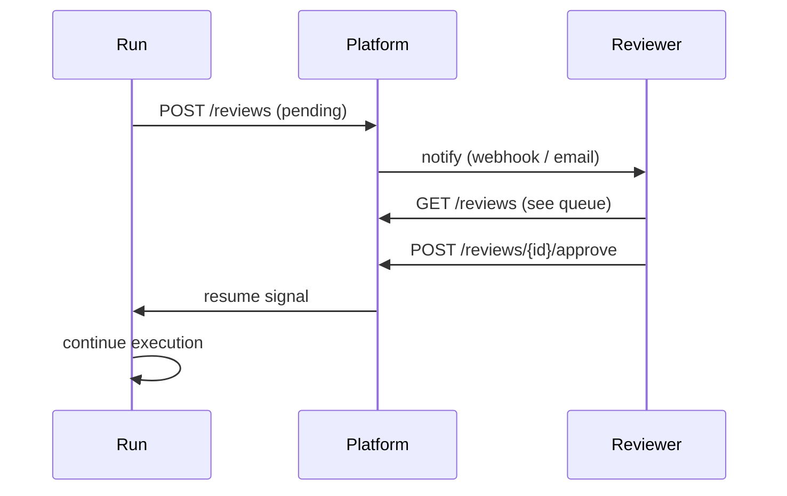

# HITL Reviews

**Human-in-the-loop (HITL)** reviews let a human approve, reject, or modify AI output before it has downstream effects.

## Creating a review

Reviews are created automatically when the engine reaches a HITL checkpoint (via the `HitlReviewer` capability), or manually from the dashboard.

## Review workflow

## Assignees

Reviews can be assigned to specific workspace members. Unassigned reviews are visible to all members with the `reviewer` role.

## Audit trail

Every review action (assign, approve, reject, comment) is recorded in the audit log with the reviewer's identity and timestamp.
