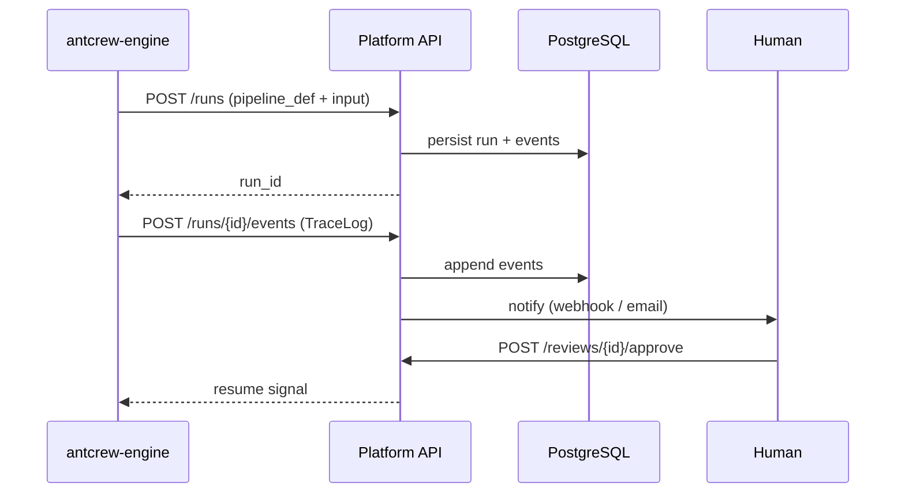

# Platform — overview

antcrew-platform is the web application and REST API that ties everything together: workspaces, runs, tickets, HITL reviews, evals, and webhooks.

## Key concepts

| Concept | Description |
|---|---|
| **Workspace** | Isolated tenant with its own API keys, members, and settings |
| **Run** | A single execution of an agent pipeline — has events, tickets, and a TraceLog |
| **Ticket** | An action item generated by a run, with a display ID (`PREFIX-00001`) |
| **HITL Review** | A human approval gate attached to a run or ticket |
| **Eval** | Automated quality check run on a schedule or on demand |
| **Webhook** | Outbound event notification to your own endpoint |

## Data flow

