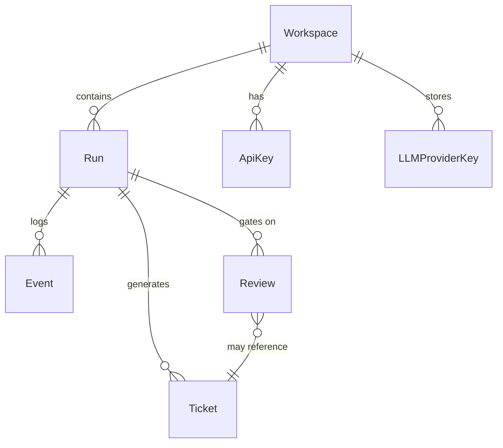

# Platform

antcrew-platform is the server-side application your team interacts with: a REST API, a WebSocket event bus, and a web dashboard. It does not execute agent code — it observes, stores, and gates it.

---

## What it manages

**Runs** — every agent execution started via the engine is a run. The platform stores its full history: status transitions, TraceLog events, generated tickets, and any HITL reviews it triggered.

**Tickets** — structured action items extracted from run output. Each workspace has a configurable prefix (`PROJ`, `ENG`, `BUG`…). Tickets get sequential display IDs — `PROJ-00001`, `PROJ-00002` — and link back to the run that created them.

**HITL reviews** — when an agent calls `hitl_checkpoint()`, the engine sends a review request to the platform. The platform queues it, notifies the right reviewer, and holds the `resume` signal until they approve or reject.

**Workspaces** — isolated tenants. Each workspace has its own API keys, members, ticket prefix, provider keys, and run history. Nothing leaks between workspaces.

**Evals** — automated quality checks that run against past runs on a schedule or on demand.

**Webhooks** — outbound notifications to your own endpoints when runs complete, tickets are created, or reviews are resolved.

---

## Real-time dashboard

The dashboard subscribes to `/ws/runs/{run_id}` and updates live as events arrive. You see:

- Current run status and elapsed time
- TraceLog events as they stream in — each LLM call, tool invocation, intermediate result
- Tickets as they are created
- HITL review cards with the full context the agent passed in

No polling. The platform pushes every event over WebSocket.

---

## Data model

---

## Key concepts

| Concept | Description |
|---|---|
| **Workspace** | Isolated tenant — own keys, members, tickets, runs |
| **Run** | One agent pipeline execution — has status, events, tickets |
| **Event** | A single TraceLog entry — LLM call, tool result, state change |
| **Ticket** | Structured action item from a run, with a display ID |
| **HITL Review** | Human approval gate that pauses a run until resolved |
| **Eval** | Automated quality check over run output |
| **Webhook** | Outbound HTTP call to your system on any platform event |

[:octicons-arrow-right-24: Quick start — run your first pipeline](getting-started.md)

[:octicons-arrow-right-24: Workspaces & API keys](workspaces.md)

[:octicons-arrow-right-24: Runs & tickets](runs.md)

[:octicons-arrow-right-24: HITL reviews](hitl.md)
