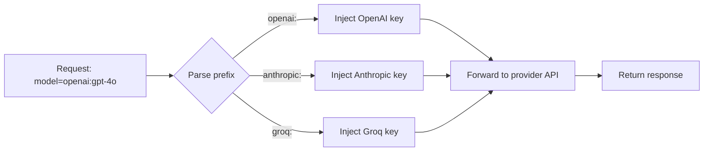

# Provider routing

The proxy routes requests to the correct provider based on the `model` field prefix.

## How routing works



The proxy strips the prefix before forwarding so the provider receives the bare model name (`gpt-4o`, `claude-sonnet-5`, etc.).

## Fallback routing

If a prefix is not recognised, the request is forwarded to the OpenAI-compatible endpoint configured as the default provider.

## Per-workspace keys

Each workspace can have different keys for each provider. The proxy resolves the correct key by workspace API key → workspace → provider key lookup.

```
Request: X-API-Key: ws_abc123, model: anthropic:claude-sonnet-5
  → look up workspace for ws_abc123
  → find workspace's Anthropic key
  → inject key + forward to api.anthropic.com
```
