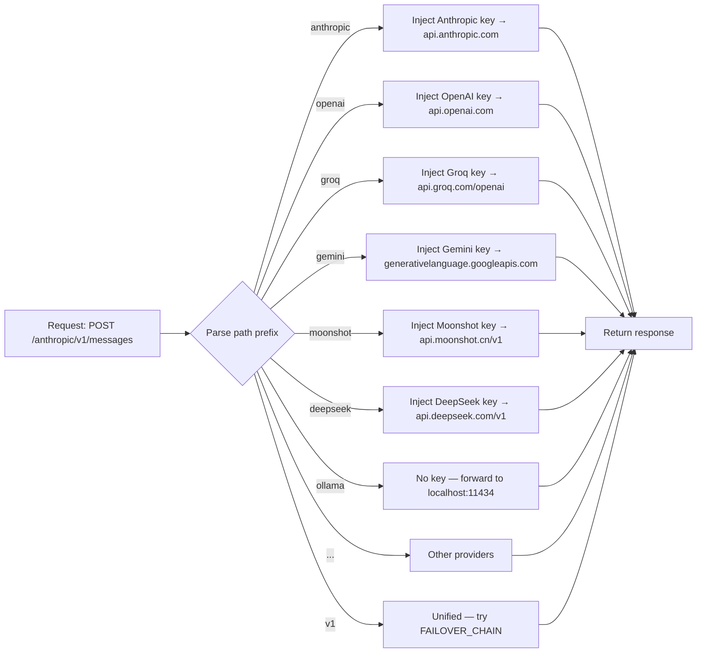

# Provider routing

The proxy routes requests to the correct provider based on the **URL path prefix**. A unified endpoint (`POST /v1/chat/completions`) additionally supports automatic provider failover.

## How routing works



The proxy strips the path prefix before forwarding, so the provider receives the bare path (`/v1/messages`, `/v1/chat/completions`, `/api/chat`).

## Supported providers

| Path prefix | Upstream | Auth header | Key variable |
|---|---|---|---|
| `/anthropic/…` | `api.anthropic.com` | `x-api-key` | `ANTHROPIC_API_KEY` |
| `/openai/…` | `api.openai.com` | `Authorization: Bearer` | `OPENAI_API_KEY` |
| `/groq/…` | `api.groq.com/openai` | `Authorization: Bearer` | `GROQ_API_KEY` |
| `/gemini/…` | `generativelanguage.googleapis.com/v1beta/openai` | `Authorization: Bearer` | `GEMINI_API_KEY` |
| `/moonshot/…` | `api.moonshot.cn/v1` | `Authorization: Bearer` | `MOONSHOT_API_KEY` |
| `/deepseek/…` | `api.deepseek.com/v1` | `Authorization: Bearer` | `DEEPSEEK_API_KEY` |
| `/mistral/…` | `api.mistral.ai/v1` | `Authorization: Bearer` | `MISTRAL_API_KEY` |
| `/xai/…` | `api.x.ai/v1` | `Authorization: Bearer` | `XAI_API_KEY` |
| `/together/…` | `api.together.xyz/v1` | `Authorization: Bearer` | `TOGETHER_API_KEY` |
| `/fireworks/…` | `api.fireworks.ai/inference/v1` | `Authorization: Bearer` | `FIREWORKS_API_KEY` |
| `/cerebras/…` | `api.cerebras.ai/v1` | `Authorization: Bearer` | `CEREBRAS_API_KEY` |
| `/azure/…` | `{AZURE_OPENAI_ENDPOINT}/openai/…` | `api-key` | `AZURE_OPENAI_API_KEY` |
| `/ollama/…` | `localhost:11434` | — | *(keyless)* |
| `/lmstudio/…` | `localhost:1234/v1` | — | *(keyless)* |
| `/vllm/…` | `localhost:8000/v1` | — | *(keyless)* |

Configure only the providers you use — others can be omitted. Override any upstream URL with the corresponding `*_BASE_URL` env var — see [Configuration](configuration.md).

---

## Unified endpoint with failover

`POST /v1/chat/completions` is an OpenAI-compatible endpoint that tries providers in the order defined by `FAILOVER_CHAIN` and returns the first successful response.

```bash
FAILOVER_CHAIN=anthropic:claude-opus-5,openai:gpt-4o,groq:llama-3.3-70b-versatile
```

**Failover triggers on:**
- Timeout — upstream does not respond within 30 seconds
- HTTP 429 — upstream returns rate-limit

The endpoint overrides the `model` field in the request body with the model defined in the chain for each provider. The response includes an `X-Proxy-Provider` header indicating which provider actually served it.

```bash
curl -X POST https://proxy.antcrew.org/v1/chat/completions \
  -H "x-api-key: your-proxy-token" \
  -H "Content-Type: application/json" \
  -d '{
    "messages": [{"role": "user", "content": "Hello"}]
  }'
```

Response headers:
```
X-Proxy-Provider: anthropic
X-Proxy-Tokens-In: 12
X-Proxy-Tokens-Out: 8
```

If all providers in the chain fail, the endpoint returns `503` with an `error.type: "failover_exhausted"` body listing which providers were tried and why each failed.

---

## Observability endpoints

### `GET /health`

Liveness and readiness check. Returns provider configuration summary.

```json
{
  "ok": true,
  "version": "2.1.0",
  "providers": {
    "anthropic": { "keys": 2, "type": "cloud" },
    "openai":    { "keys": 1, "type": "cloud" },
    "ollama":    { "keys": 0, "type": "local" }
  },
  "failover_chain": ["anthropic:claude-opus-5", "openai:gpt-4o"]
}
```

### `GET /metrics`

In-memory request statistics. Resets on process restart.

```json
{
  "requests": 1842,
  "tokens": { "in": 2104832, "out": 512048 },
  "latency_ms": { "p50": 342.1, "p99": 1821.4 },
  "errors": { "HTTP429": 3, "HTTP500": 1 },
  "uptime_s": 43200.0
}
```

Latency p50/p99 are computed from the last 100 requests. Errors are keyed by HTTP status code string.

---

## Local providers (Ollama, LM Studio, vLLM)

Local providers need no API key. Run the proxy **on the same machine** as the local server and expose port 8080 publicly:

```bash
docker run -d -p 8080:8080 \
  -e PROXY_TOKEN=your-token \
  ghcr.io/iagop03/antcrew-proxy:latest
# Ollama is assumed at localhost:11434
```

To point to a remote Ollama instance:

```bash
-e OLLAMA_BASE_URL=http://my-ollama-server:11434
```

## Fallback routing

If the path prefix is not recognised, the proxy returns `404` with the list of supported providers.

## Token usage headers

For non-streaming responses, the proxy injects two response headers after reading the upstream body:

| Header | Value |
|---|---|
| `X-Proxy-Tokens-In` | Input tokens from the `usage` field |
| `X-Proxy-Tokens-Out` | Output tokens from the `usage` field |

These headers are read by `antcrew-platform` to update `AgentEvent` rows without making a separate accounting request. Streaming responses omit these headers because usage data is only available in the final SSE chunk, which the proxy does not buffer.
