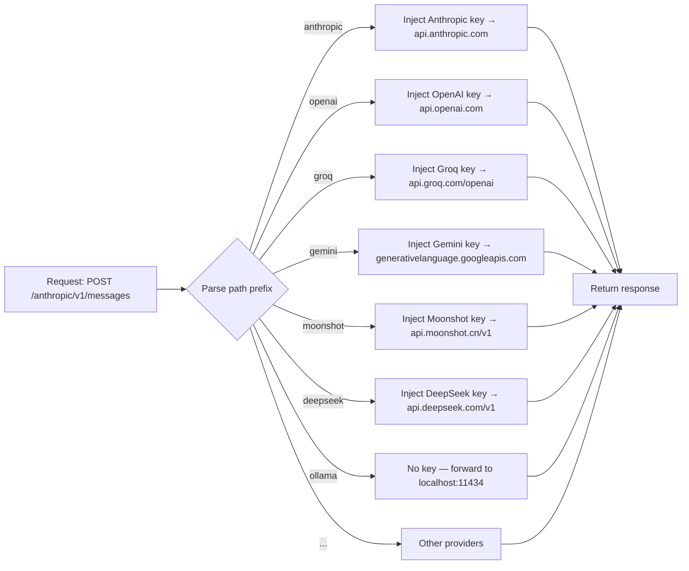

# Provider routing

The proxy routes requests to the correct provider based on the **URL path prefix**.

## How routing works



The proxy strips the path prefix before forwarding, so the provider receives the bare path (`/v1/messages`, `/v1/chat/completions`, `/api/chat`).

## Supported providers

| Path prefix | Upstream | Auth header | Key variable |
|---|---|---|---|
| `/anthropic/…` | `api.anthropic.com` | `x-api-key` | `ANTHROPIC_API_KEY` |
| `/openai/…` | `api.openai.com` | `Authorization: Bearer` | `OPENAI_API_KEY` |
| `/groq/…` | `api.groq.com/openai` | `Authorization: Bearer` | `GROQ_API_KEY` |
| `/gemini/…` | `generativelanguage.googleapis.com/v1beta/openai` | `Authorization: Bearer` | `GEMINI_API_KEY` |
| `/moonshot/…` | `api.moonshot.cn/v1` | `Authorization: Bearer` | `MOONSHOT_API_KEY` |
| `/deepseek/…` | `api.deepseek.com/v1` | `Authorization: Bearer` | `DEEPSEEK_API_KEY` |
| `/mistral/…` | `api.mistral.ai/v1` | `Authorization: Bearer` | `MISTRAL_API_KEY` |
| `/xai/…` | `api.x.ai/v1` | `Authorization: Bearer` | `XAI_API_KEY` |
| `/together/…` | `api.together.xyz/v1` | `Authorization: Bearer` | `TOGETHER_API_KEY` |
| `/fireworks/…` | `api.fireworks.ai/inference/v1` | `Authorization: Bearer` | `FIREWORKS_API_KEY` |
| `/cerebras/…` | `api.cerebras.ai/v1` | `Authorization: Bearer` | `CEREBRAS_API_KEY` |
| `/ollama/…` | `localhost:11434` | — | *(keyless)* |
| `/lmstudio/…` | `localhost:1234/v1` | — | *(keyless)* |
| `/vllm/…` | `localhost:8000/v1` | — | *(keyless)* |

Configure only the providers you use — others can be omitted. Set `ANTHROPIC_BASE_URL` / `OPENAI_BASE_URL` / etc. to override any upstream URL.

## Local providers (Ollama, LM Studio, vLLM)

Local providers need no API key. Run the proxy **on the same machine** as the local server and expose port 8080 publicly:

```bash
docker run -d -p 8080:8080 \
  -e PROXY_TOKEN=your-token \
  ghcr.io/iagop03/antcrew-proxy:latest
# Ollama is assumed at localhost:11434
```

To point to a remote Ollama instance:

```bash
-e OLLAMA_BASE_URL=http://my-ollama-server:11434
```

## Per-workspace keys

Each workspace can have different keys for each provider. The proxy resolves the correct key from the workspace token:

```
Request: Authorization: Bearer ws_abc123, path: /anthropic/v1/messages
  → validate token ws_abc123
  → inject ANTHROPIC_API_KEY
  → forward to api.anthropic.com/v1/messages
```

## Fallback routing

If the path prefix is not recognised, the proxy returns `404` with the list of supported providers.
